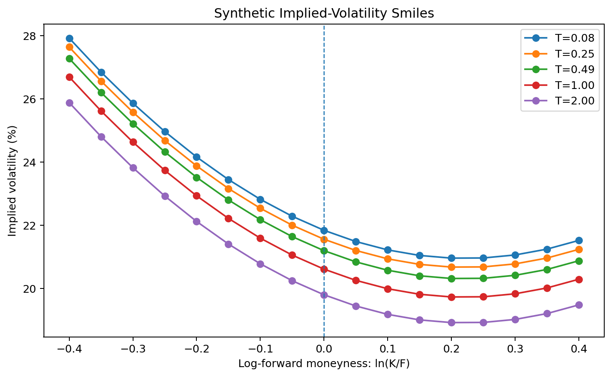
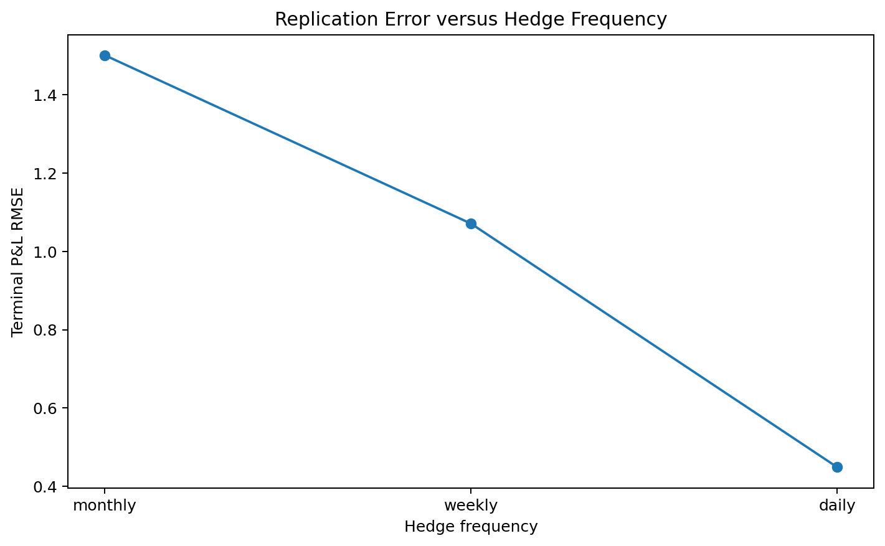
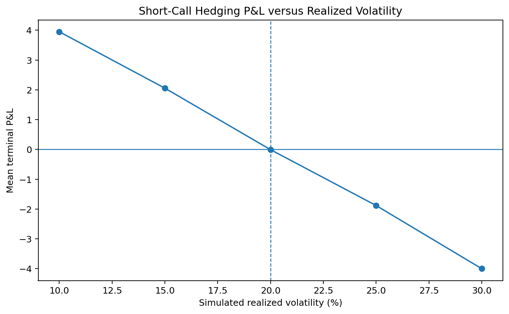

# Options Pricing, Volatility, and Delta Hedging in Python

I began with a question that tends to disappear in textbook examples: once a pricing formula returns a value and a delta, what actually happens when the hedge is rebalanced through time?

I worked through the problem from the bottom up. The code starts with payoffs, no-arbitrage bounds, and put–call parity, then moves to Black–Scholes pricing, Greeks, implied-volatility inversion, a simple volatility surface, and a self-financing delta hedge. The cash ledger became the central part of the project because it makes every stock trade, financing charge, option settlement, and transaction cost visible.

The model is deliberately narrow. It is meant to help me reason carefully about pricing and hedging mechanics, not to represent a live trading system or provide trading advice.

## Questions that guided the work

- How do option values and Greeks change with spot, strike, volatility, maturity, and rates?
- When do bisection, safeguarded Newton–Raphson, and Brent's method behave differently during implied-volatility recovery?
- Can a smooth-looking volatility surface still violate basic no-arbitrage conditions?
- How much does more frequent delta rebalancing reduce replication error?
- When do transaction costs offset the benefit of more frequent hedging?
- How does a delta-hedged short option respond when realized volatility differs from the volatility used for pricing?
- Which parts of terminal P&L come directly from the cash ledger, and which are only local approximations based on Greeks?

## What I observed in the fixed-seed runs

I kept the simulations moderate so that the full set of tables and figures can be rebuilt on a normal laptop.

- The three implied-volatility solvers recovered the known synthetic volatility values, with a maximum absolute error below **1.8 × 10⁻¹¹** in the exported comparison.
- Call and put prices generated from the synthetic surface were inverted back to implied volatility and checked against price bounds, strike monotonicity, convexity, and calendar total-variance consistency.
- With implied and realized volatility both set to 20% and no transaction costs, the terminal P&L RMSE of a short-call hedge fell from about **1.50** with monthly rebalancing to **0.45** with daily rebalancing.
- With a 5-basis-point proportional trading cost, average cost rose from about **0.11** for monthly hedging to **0.30** for daily hedging.
- With implied volatility fixed at 20%, the average daily-hedged short-call P&L was positive when realized volatility was simulated at 10–15%, close to zero at 20%, and negative at 25–30%.
- The selected-path cash ledger and the counterfactual P&L attribution reconciled to floating-point precision.







## Files

```text
.
├── data/processed/                  # Synthetic volatility-surface data
├── docs/                            # Model choices, checks, and working notes
├── notebooks/                       # Eight executed notebooks
├── outputs/
│   ├── figures/                     # Generated plots
│   └── tables/                      # Solver, surface, hedging, and P&L results
├── scripts/run_experiments.py       # Rebuilds datasets, tables, and figures
├── src/options_lab/                 # Pricing, risk, hedging, and attribution code
├── tests/                           # Automated checks
├── pyproject.toml
└── requirements.txt
```

## Code map

| Module | What it contains |
|---|---|
| `payoffs.py` | Call and put payoffs, plus long/short profit |
| `arbitrage.py` | Discounting, price bounds, and put–call parity |
| `black_scholes.py` | Vectorized European option pricing |
| `greeks.py` | Analytical delta, gamma, vega, theta, and rho |
| `numerical_greeks.py` | Finite-difference checks for the analytical Greeks |
| `implied_volatility.py` | Bisection, safeguarded Newton, and Brent inversion |
| `volatility_surface.py` | Synthetic smiles, IV recovery, and static-arbitrage checks |
| `price_paths.py` | Geometric-Brownian-motion price paths |
| `delta_hedging.py` | Self-financing hedge ledger and rebalancing logic |
| `pnl_attribution.py` | Exact and approximate P&L attribution |
| `metrics.py` | Realized-volatility and hedging summaries |
| `risk.py` | Local Greek-based P&L approximation |

## Run it locally

```bash
python -m venv .venv
source .venv/bin/activate          # Windows: .venv\Scripts\activate
python -m pip install --upgrade pip
python -m pip install -e ".[dev]"
pytest
python scripts/run_experiments.py
```

The experiment script uses fixed random seeds and recreates the contents of `data/processed/` and `outputs/`.

## Small example

```python
from options_lab.black_scholes import black_scholes_price
from options_lab.greeks import black_scholes_greeks
from options_lab.implied_volatility import implied_volatility_brent

call = black_scholes_price(
    spot=100.0,
    strike=100.0,
    rate=0.05,
    time_to_expiry=1.0,
    volatility=0.20,
    option_type="call",
)

greeks = black_scholes_greeks(
    spot=100.0,
    strike=100.0,
    rate=0.05,
    time_to_expiry=1.0,
    volatility=0.20,
    option_type="call",
)

iv = implied_volatility_brent(
    market_price=call,
    spot=100.0,
    strike=100.0,
    rate=0.05,
    time_to_expiry=1.0,
    option_type="call",
)
```

## Notebook sequence

1. `01_option_payoffs.ipynb` — payoff, profit, moneyness, and break-even logic
2. `02_no_arbitrage_and_parity.ipynb` — bounds, discounting, and replication
3. `03_black_scholes_pricing.ipynb` — pricing and consistency checks
4. `04_greeks_and_risk.ipynb` — analytical and numerical sensitivities
5. `05_implied_volatility.ipynb` — inversion and low-vega cases
6. `06_volatility_surface.ipynb` — smile, skew, term structure, and arbitrage checks
7. `07_dynamic_delta_hedging.ipynb` — stock, cash, financing, settlement, and costs
8. `08_pnl_attribution.ipynb` — ledger, counterfactual, Greek, and variance attribution

## How I checked the calculations

The automated checks cover:

- known Black–Scholes prices and Greeks;
- payoff and long/short sign symmetry;
- no-arbitrage bounds and put–call parity;
- analytical Greeks against central finite differences;
- scalar and vectorized pricing behavior;
- zero-time and zero-volatility boundary cases;
- recovery of known implied volatilities;
- surface inversion and basic static-arbitrage conditions;
- reproducible price-path simulation;
- self-financing hedge accounting;
- long/short P&L symmetry without costs;
- ledger and counterfactual attribution reconciliation.

Run them with:

```bash
pytest
```

## Where the model stops

The baseline assumes European exercise, no dividends, geometric Brownian motion, constant volatility and interest rates, continuous market availability, symmetric borrowing and lending rates, and proportional stock-trading costs.

I did not include jumps, stochastic volatility, discrete dividends, early exercise, market impact, margin constraints, or cross-hedging across several options. Those omissions matter, especially when interpreting the hedging results beyond the controlled experiments shown here.

More detail is available in [`docs/methodology.md`](docs/methodology.md), [`docs/validation.md`](docs/validation.md), and [`docs/technical_notes.md`](docs/technical_notes.md).

## License

MIT License. See [`LICENSE`](LICENSE).
