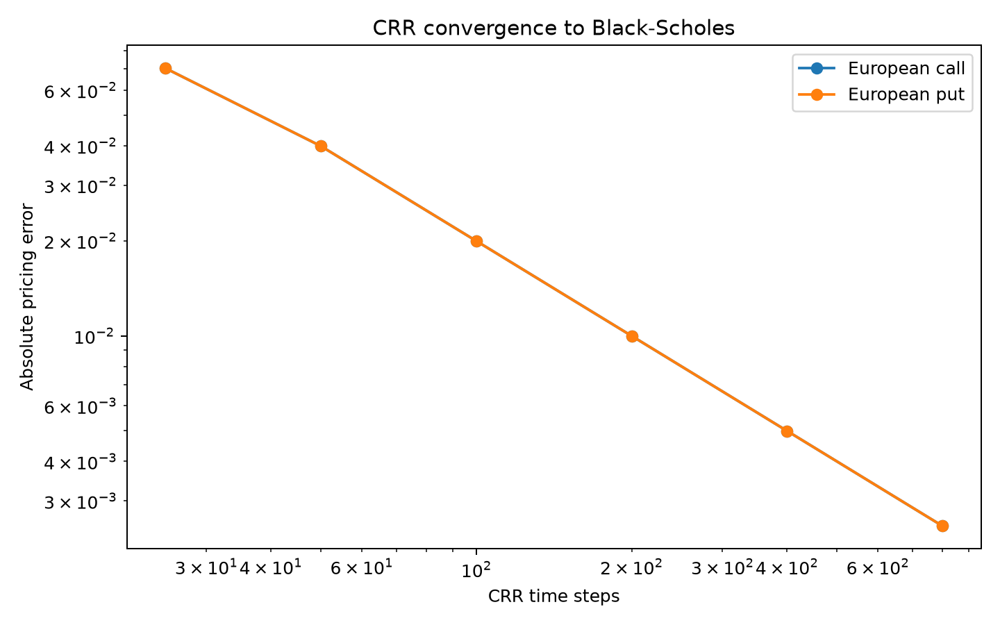
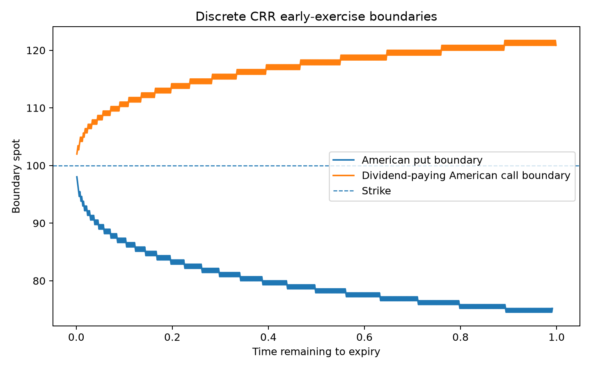

# CRR binomial pricing and American early exercise

This extension adds a Cox-Ross-Rubinstein binomial tree alongside the existing Black-Scholes implementation.

## Model

For a time step `dt`, the tree uses:

`u = exp(sigma sqrt(dt))`

`d = 1 / u`

`p = [exp((r - q) dt) - d] / (u - d)`

where `q` is a continuous dividend yield.

European options use discounted risk-neutral continuation values at every node. American options additionally compare continuation value with intrinsic value and take the larger quantity.

The implementation rejects parameter/step combinations that produce a risk-neutral probability outside `[0, 1]` rather than silently clipping a materially invalid tree.

## European convergence check

The non-dividend European CRR prices were compared with the repository's independent Black-Scholes implementation.

| Steps | Call error | Put error |
|---:|---:|---:|
| 25 | 0.07038205 | 0.07038205 |
| 50 | 0.03989203 | 0.03989203 |
| 100 | 0.01997191 | 0.01997191 |
| 200 | 0.00999231 | 0.00999231 |
| 400 | 0.00499773 | 0.00499773 |
| 800 | 0.00249926 | 0.00249926 |

At the finest saved grid of **800 steps**, the absolute pricing error was **0.002499** for the call and **0.002499** for the put.

## Early-exercise experiments

Three cases were used to separate the main economics.

| Scenario | European | American | Early-exercise premium | Boundary points |
|---|---:|---:|---:|---:|
| non_dividend_call | 10.448084 | 10.448084 | 0.000000 | 0 |
| deep_itm_put | 18.265436 | 20.364078 | 2.098642 | 793 |
| dividend_call | 16.192435 | 20.012970 | 3.820534 | 799 |

### Non-dividend-paying call

The American and European CRR values are numerically identical in the saved experiment, and the tree contains no pre-expiry exercise nodes. This is the expected benchmark for a call on a non-dividend-paying underlying when rates are non-negative.

### Put

The deep-in-the-money put has an early-exercise premium of **2.098642** in the saved 800-step experiment. The tree records a non-empty exercise region at low underlying prices.

### Dividend-paying call

With an 8% continuous dividend yield and 2% interest rate, the American call has an early-exercise premium of **3.820534**. The saved tree therefore shows that the no-early-exercise result for calls does not extend unchanged to sufficiently dividend-paying underlyings.

## Boundary interpretation

At every pre-expiry tree level where immediate exercise dominates continuation, the code records a discrete boundary:

- for a put, the highest spot at which exercise is optimal;
- for a call, the lowest spot at which exercise is optimal.

The saved put experiment contains **793** boundary points and the dividend-call experiment contains **799**.

Because the CRR tree is discrete, the boundary oscillates slightly between adjacent levels. It should be interpreted as a numerical approximation that becomes finer as the number of steps increases.

## Scope

The CRR module supports a continuous dividend yield. It does not yet model discrete cash-dividend dates, stochastic rates, local/stochastic volatility, transaction costs inside the tree, or optimal exercise under market frictions.
